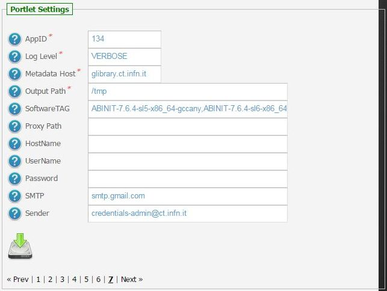
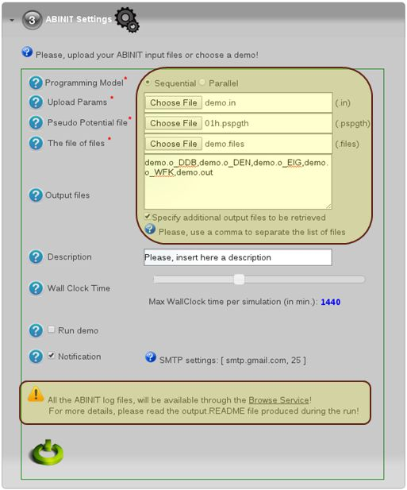

============
About
============

.. image:: images/ABINIT_logo.png
   :height: 100px
   :align: left
   :target: http://www.abinit.org/
-------------

.. _ABINIT: http://www.abinit.org/

ABINIT_ is a package whose main program allows one to find the total energy, charge density and electronic structure of systems made of electrons and nuclei (molecules and periodic solids) within Density Functional Theory (DFT), using pseudopotentials and a planewave or wavelet basis. 

ABINIT_ also includes options to optimize the geometry according to the DFT forces and stresses, or to perform molecular dynamics simulations using these forces, or to generate dynamical matrices, Born effective charges, and dielectric tensors, based on Density-Functional Perturbation Theory, and many more properties. 

Excited states can be computed within the Many-Body Perturbation Theory (the GW approximation and the Bethe-Salpeter equation), and Time-Dependent Density Functional Theory (for molecules). In addition to the main ABINIT_ code, different utility programs are provided. 

ABINIT_ is a project that favours development and collaboration `(short presentation of the ABINIT project) <http://www.abinit.org/about/presentation.pdf>`_.

============
Installation
============
To install the abinitDM portlet the WAR file has to be deployed into the application server.

As soon as the portlet has been successfully deployed on the Science Gateway the administrator has to configure:

- the list of e-Infrastructures where the application can be executed;

- some additional application settings.

1.) To configure a generic e-Infrastructure, the following settings have to be provided:

**Enabled**: A true/false flag which enables or disable the generic e-Infrastructure;

**Infrastructure**: The acronym to reference the e-Infrastructure;

**VOName**: The VO for this e-Infrastructure;

**TopBDII**: The Top BDII for this e-Infrastructure;

**WMS Endpoint**: A list of WMS endpoint for this e-Infrastructure (max. 10);

**MyProxyServer**: The MyProxyServer for this e-Infrastructure;

**eTokenServer**: The eTokenServer for this e-Infrastructure;

**Port**: The eTokenServer port for this e-Infrastructure;

**Serial Number**: The MD5SUM of the robot certificate to be used for this e-Infrastructure;

**WebDAV**: The EMI-3 DPM Grid Storage Element, with WebDAV interface, to be used for this e-Infrastructure;

In Fig. 1 is shown how the portlet has been configured to run simulation on the EUMEDGRID-Support e-Infrastructure.

2.) To configure the application, the following settings have to be provided:

**AppID**: The ApplicationID as registered in the UserTracking MySQL database (GridOperations table);

**Log Level**: The log level for the application (e.g.: *INFO* or *VERBOSE*);

**Metadata Host**: The Metadata hostname where download/upload digital-assets (e.g. *glibrary.ct.infn.it*);

**Software TAG**: The list of software tags requested by the application;

**SMTP Host**: The SMTP server used to send notification to users;

**Sender**: The FROM e-mail address to send notification messages about the jobs execution to users;

In Fig. 2 is shown how the application has been set.

============
Usage
============
The run abinit simulation the user has to click on the third accordion, select the type of job to run (e.g. *'Sequential'* or *'Parallel'*)
and upload the input files.

The ABINIT_ input files consist of:

- An input file (.in);

- A list of Pseudo Potential files;

- A file of files (.files).

For demonstrative use cases, the user can also click on _'Run demo'_ and execute ABINIT_ with some pre-configured inputs.

============
Support
============
Please feel free to contact us any time if you have any questions or comments.

.. _INFN: http://www.ct.infn.it/
.. _DFA: http://www.dfa.unict.it/
.. _CERIST: http://www.cerist.dz/

:Authors:
 `Giuseppe LA ROCCA <mailto:giuseppe.larocca@ct.infn.it>`_ - Italian National Institute of Nuclear Physics (INFN_),

 `Mario TORRISI <mailto:mario.torrisi@ct.infn.it>`_ - University of Catania (DFA_),

 `Brahim LAGOUN <mailto:lag17_brahim@yahoo.fr>`_,

 `Ouafa BENTALB <mailto:o.bentaleb@grid.arn.dz>`_ (CERIST_),

:Version: v2.0.1, 2015

:Date: May 28th, 2015 16:21
